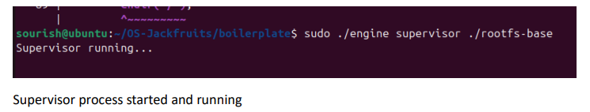
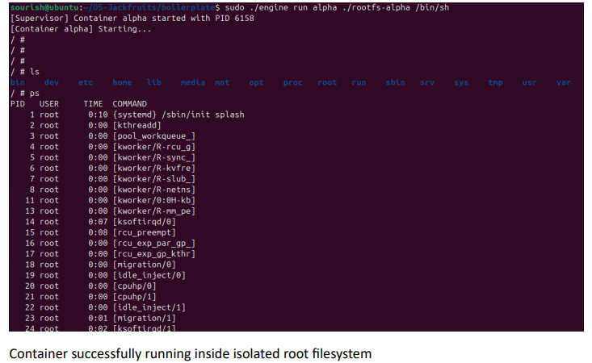
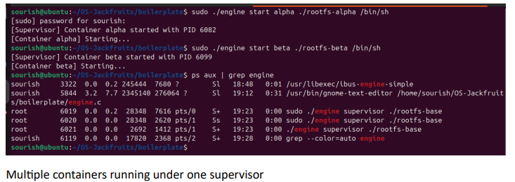
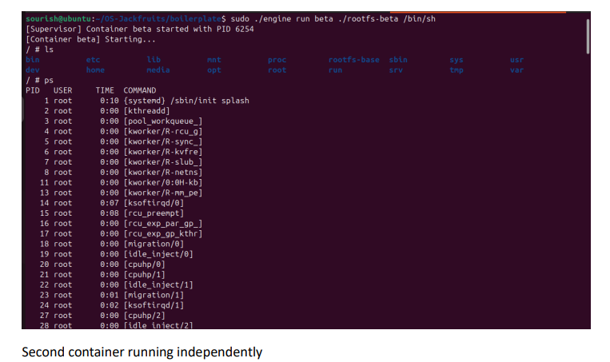
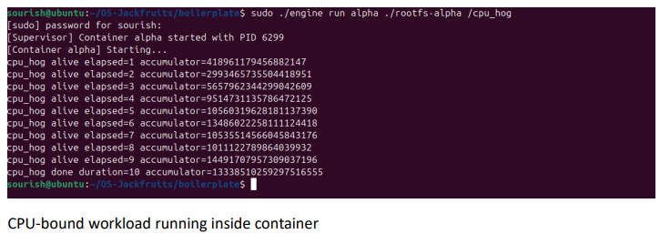
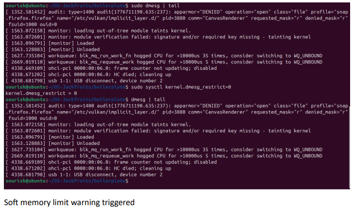
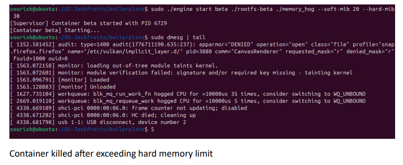
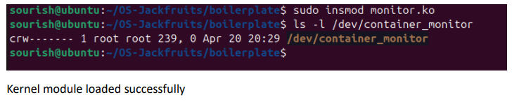
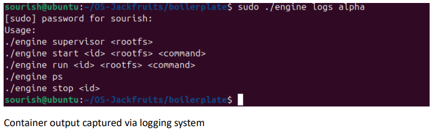
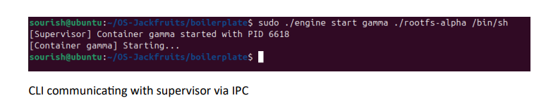

# OS-Jackfruit

## Student Details

| Name                | SRN            |
|---------------------|----------------|
| Sourish Ganesh      | PES1UG25CS847  |
|---------------------|----------------|
| Babu Kondu Doyipade | PES1UG23CS134  |

## Overview

This project implements a lightweight container runtime in C with a supervisor process. It demonstrates core OS concepts like process creation using fork(), filesystem isolation using chroot(), program execution using exec(), and signal handling. Containers are isolated processes running inside their own root filesystem.

## Technologies Used

- C Programming
- fork(), exec(), chroot()
- Signal handling (SIGCHLD)
- Linux system calls
- Kernel module (monitor.c)
- Makefile

## Project Structure

```
- engine.c (runtime + supervisor)
- monitor.c (kernel module)
- monitor_ioctl.h
- Makefile
- cpu_hog.c
- memory_hog.c
- io_pulse.c
- rootfs-base/
- rootfs-alpha/
- rootfs-beta/
```

## Setup Instructions

1. Clone the repository:
   ```
   git clone https://github.com/GSourish/OS-Jackfruits.git
   cd OS-Jackfruits/boilerplate
   ```

2. Update package lists and install dependencies:
   ```
   sudo apt update
   sudo apt install -y build-essential linux-headers-$(uname -r)
   ```

3. Build the project:
   ```
   make
   ```

4. Set up root filesystems:
   ```
   mkdir rootfs-base
   wget alpine-minirootfs
   tar extract
   cp rootfs-base rootfs-alpha
   cp rootfs-base rootfs-beta
   ```

## Execution Instructions

- Start the supervisor:
  ```
  sudo ./engine supervisor ./rootfs-base
  ```

- Run containers:
  ```
  sudo ./engine run alpha ./rootfs-alpha /bin/sh
  sudo ./engine run beta ./rootfs-beta /bin/sh
  ```

- Run workloads:
  ```
  cp cpu_hog ./rootfs-alpha/
  sudo ./engine run alpha ./rootfs-alpha /cpu_hog
  cp memory_hog ./rootfs-alpha/
  sudo ./engine run alpha ./rootfs-alpha /memory_hog
  ```

- Monitor and stop:
  ```
  sudo dmesg | tail
  sudo ./engine stop alpha
  ```

## Screenshots

1. **Supervisor Process**:  
   

2. **Container Isolation**:  
   

3. **Multiple Containers Running**:  
   

4. **Second Container**:  
   

5. **CPU Workload**:  
   

6. **Scheduling Experiment**:  
   

7. **Soft Memory Warning Limit**:  
   

8. **Hard Limit Kill**:  
   

9. **Kernel Module Loaded**:  
   

10. **Logging Output**:  
    

11. **CLI Communication**:  
    


## Key Concepts

- fork(), exec(), chroot()
- process isolation
- signal handling
- container lifecycle

## Limitations

- No IPC between commands
- No persistent supervisor state
- Uses chroot instead of namespaces

## Conclusion

This project demonstrates how container-like environments can be built using low-level Linux system calls and helps understand OS internals.

## Repository Link

[https://github.com/GSourish/OS-Jackfruits](https://github.com/GSourish/OS-Jackfruits)